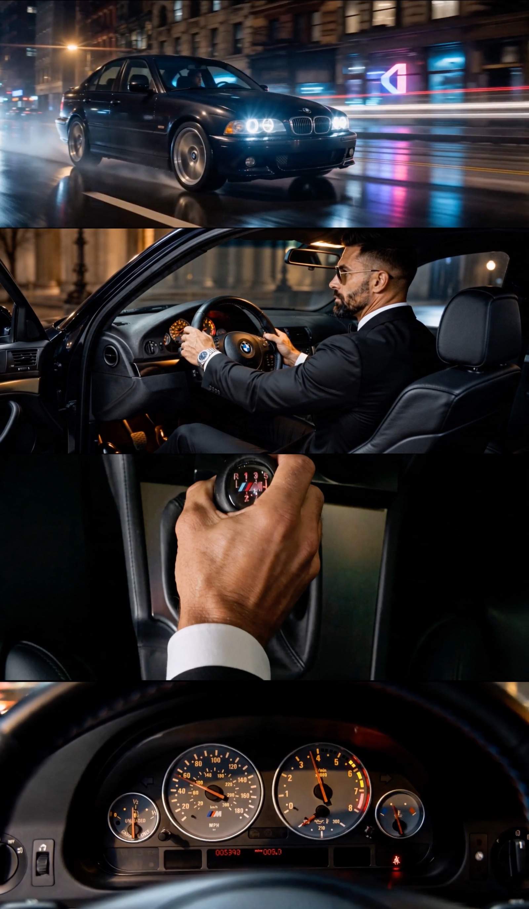
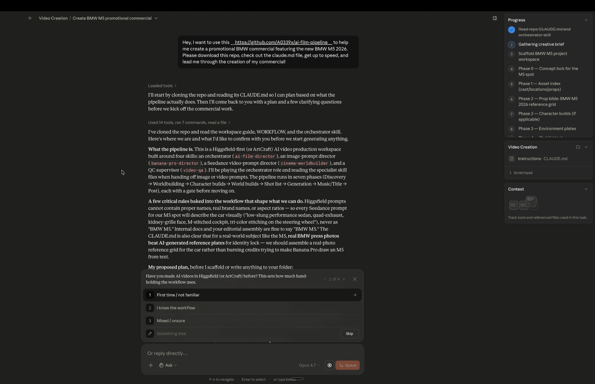

# AI Film Pipeline — guided skill set for high-end AI video production in Higgsfield

<p align="center">
  
</p>

<p align="center">
  
</p>

<p align="center">
  
</p>

<p align="center"><em>The two specialist skills in this repo are built on top of Joey's original work for <strong>CTRL</strong> — an AI-generated K-Pop group. On-stage performance frames, tight subject portraits, behind-the-scenes life in the loft — every shot AI-built. <a href="https://youtu.be/kIxZJL4snE0">Watch CTRL's new music video "OUR TURN" on YouTube</a> · directed by Joey (<a href="https://www.instagram.com/acornjoey/">@acornjoey</a>), NYC. If you follow him, mention that a0339x sent you.</em></p>

<p align="center">
  
</p>

<p align="center"><em>A 30-second BMW E39 M5 black-tie commercial — every shot built with this pipeline. Real-photo references → ChatGPT character sheets → Seedance shots on ArtCraft. Roughly one weekend, around $10 in generation credits.</em></p>

---

## Starting guide — read this first

**This is the only section you need to read to start using the project.** GitHub is built for developers, and it shows — the file listings, the green buttons, the talk of clones and pull requests. **You can ignore all of it.** The only piece of information you actually need is the link to this page:

```
https://github.com/A0339x/ai-film-pipeline
```

Open the **Claude desktop app** in **Cowork mode** (or run `claude` in your terminal if you're already comfortable there), start a new task, and paste a message like:

> *Hey, I want to use this https://github.com/A0339x/ai-film-pipeline to help me create a promotional BMW commercial featuring the new BMW M5 2026. Please download this repo, check out the CLAUDE.md file, get up to speed, and lead me through the creation of my commercial!*

Swap "promotional BMW commercial featuring the new BMW M5 2026" for whatever you actually want to make — a music video, a short film, a brand spot, a perfume teaser, anything. The orchestrator clones the repo, reads `CLAUDE.md`, follows the workflow, and starts asking you the right questions one at a time.

<p align="center">
  
</p>

<p align="center"><em>That's the whole onboarding. Drop the link, ask Claude to download the repo and read <code>CLAUDE.md</code>, describe your project — and watch the agent map every phase (right sidebar), then start asking the right questions one at a time. The whole pipeline runs from there.</em></p>

The rest of this README (install paths, skill anatomy, platform recommendations, file conventions) is the full reference — useful once you're deep in a project, but skippable for your first run.

---

---

End-to-end skill set for making cinema-grade AI videos in Higgsfield without burning credits on shots that drift. Five skills work together: two specialists that write the prompts, one content-authoring skill that locks your world and character voices into canon, one orchestrator that leads you through the whole project, and one QC supervisor that catches drift before it ships. Runs in **Claude Code (recommended — easiest install)** or **claude.ai (web/desktop app)**.

Built on top of original skills by **Joey** (the creator of the AI-built K-Pop short film [*CTRL: Hunters*](https://youtu.be/sVib0X-PvsY)) — extended with a guided orchestrator + QC layer to walk first-time users through the workflow.

---

## Scope — what this is and what it isn't

**This is the pre-production and asset-generation pipeline.** It gets you everything you need to assemble a finished film: locked character sheets, environment plates, hero prop sheets, Seedance video clips, an original Suno music track, a title card, and a full shot list and generation log to organize it all.

**This is NOT a video editor.** The skills don't cut, color, conform, master, or assemble. Once you have your clips, music, and title card, you take them into a real NLE (DaVinci Resolve, Premiere, Final Cut, etc.) and edit the film yourself. The pipeline ends at "you have all the parts" — the assembly is on you.

Think of it as the difference between a production crew and a post-production editor: this skill set is the crew that shoots and delivers the dailies. The cut is still your job.

## What this gives you

A complete operating system for the *creation* side of AI video projects in Higgsfield:

- **Character consistency across hundreds of generations.** Lock a character once, reuse forever. The skills enforce naming discipline, locked photoreal stacks, and 3-panel reference sheets (headless full-body front, full-body rear with head, tight chest-up face lock — one face on the whole sheet, roughly double the resolution per cell of the old 6-panel format) that keep faces from drifting by Shot 3.
- **Voice consistency across an entire cast.** `story-bible-builder` interviews you into a per-character canon — locked, prompt-ready quoted Speech / Movement / Stillness lines — so every Seedance shot pulls the same voice instead of reinventing it take to take. Build it once with "build a story bible," then every `cinema-worldbuilder` prompt for that character reads from it.
- **Cinema-grade camera grammar.** Five locked cinema modes (Narrative / Studio / Action / Performance / Atmospheric), each with its own ARRI body, lens stack, filtration, and Kodak film emulation grade. Prompts come out looking like they were shot, not rendered.
- **Credit savings by design.** Pitfall flags fire before you generate shots that won't earn — character not locked, runtime overshoot past Seedance's 15s reliability window, mode mismatch, music language leaking into video prompts, brand contamination. The source production team burned ~7,500 credits on their first project; their post-mortem said they could have done it in 3,000 with this workflow in hand.
- **Guided pipeline for first-timers, lean iterative loop for pros.** Two operating modes per skill, switchable mid-project. Newbies get walked through seven structured phases. Pros run a five-step iterative loop with just-in-time builds.
- **QC before ship.** A dedicated skill audits the project against locked bibles — eight scored categories in guided mode, three lean checks (drift / continuity / prompt audit) in pro mode. Pause-with-evidence, prescribed fix path, hand back to the right specialist to regenerate.
- **Multi-frame drift detection.** QC uses `ffmpeg` to extract frames at 1 fps from every generated clip, then compares each frame against the locked references. Catches within-clip drift that single-thumbnail audit misses — wrong-generation prop slips (e.g. an E39 M5 with E46 taillights), identity wobble across a long take, animation artifacts at specific moments, hand-through-wheel clipping, etc. Cross-platform install paths documented; graceful fallback paths for users who can't install ffmpeg.
- **Multi-project workspace.** One repo, many films. Each project lives in its own `projects/<project-name>/` folder with isolated bibles, references, clips, and QC reports. A single `scripts/new-project.sh` command scaffolds a fresh project workspace from the bundled templates. Projects don't collide; you can be running a music video, a brand spot, and a short film concurrently without their assets stepping on each other.
- **Real-world references over AI-generated, when available.** If your subject exists in the real world — a specific car, a specific watch, a specific architectural style, a real location — **use real photos as your reference assets rather than generating new ones**. A multi-panel grid built from real photographs of an E39 M5 cockpit locks identity tighter than any AI-generated cockpit plate, costs zero credits, takes 5 minutes to assemble, and gives you fine detail (M-tri-color stitching, H-pattern shift gate, gauge cluster numerals) that's hard to prompt accurately. The pipeline treats real-world reference photos as first-class anchors — drop them into `references/` exactly as you would an AI-generated plate.

What you get out at the end: a folder of locked references, a folder of generated clips, a music track, a title card image, and the bibles + shot list + generation log that document how the project was built. You bring that bundle into your NLE of choice and cut the film.

---

## The five skills

| Skill | Role | Owns |
|---|---|---|
| **`banana-pro-director`** | Image prompts | Character outfits on 18% gray seamless (flat, shadowless grade — white is explicit-request only), 3-panel character sheets (the locked default — headless full-body front, full-body rear with head, tight chest-up face lock), scene plates, GPT-2 detail face shots, plus Mode 0 face-lock and Mode 5 outfit-replacement. Enforces the locked photoreal stack. 6-panel sheets are legacy, built only on explicit request. |
| **`cinema-worldbuilder`** | Seedance video prompts | Five cinema modes with locked camera/lens/filtration/grade, per-shot runtime, diegetic audio rule, multi-shot per-shot timing. Two-part delivery: a bolded title line with runtime, then a single code block of ten labeled blocks (Scene & Mood, Frame Map, Subject Lock, Cross-Frame Rules, Movement, Last Frame, World Plate, Sound Bed, Capture Realism, Camera Capture). References attach via user-named element tags (`@sol_ref`) instead of image indices; lens choice anchors to FOV in degrees first, millimeters parenthetical. |
| **`story-bible-builder`** | Story canon / voice consistency | Interview-driven world + character bible — premise, thesis, timeline/eras, factions, locations, world rules, and per-character function/visual-lock/backstory/psychology plus prompt-ready quoted Speech / Movement / Stillness lines, ensemble dynamics, structural engines, production rules. Saves to `projects/<name>/story-bible.md`. Feeds `cinema-worldbuilder` directly so character voice stays locked across every shot. |
| **`ai-film-director`** | Pipeline orchestrator | Leads users from a one-line intention through every phase of the project. Calls the specialists (and, for narrative projects, `story-bible-builder`) at the right moments. Pauses for Higgsfield generation. Protects against credit-burning pitfalls. Two modes: guided (seven phases) or pro (five-step loop). |
| **`video-qa`** | QC supervisor | Audits the project against locked character/environment/prop bibles. Uses `ffmpeg` for **multi-frame extraction at 1 fps per clip** so drift within a single shot gets caught — wrong-generation prop slips, identity wobble, animation artifacts at specific moments, hand-through-object clipping. Pauses with evidence (specific frame numbers), prescribes fixes, hands back to specialists to regenerate. Two modes: guided (eight scored categories, Ship/Hold/Block verdict) or pro (drift + continuity + prompt scan, no score). Graceful fallback if ffmpeg can't be installed. |

---

## Install

Two install paths. Pick whichever matches how you already work with Claude.

### Path A — Claude desktop app, Cowork mode (recommended for first-time producers)

If you're using the Claude desktop app, run this in **Cowork mode** — it's the right fit for AI film production specifically. Three reasons:

1. **The Cowork Progress sidebar mirrors the pipeline's eight tracked phases (0–7).** Discovery → Worldbuilding → Character builds → World builds → Shot list → Generation → Music/Title → Post. Each phase shows up as a tracked step on the right-hand side as the orchestrator works through it. You always know where you are.
2. **AI film production is async-heavy.** You step away to generate in ArtCraft, edit in your NLE, run Suno, come back the next day to look at locked clips. Cowork tasks persist across that — the plan stays visible, you can queue messages while the agent works, and resuming is one click.
3. **The interactive question UI is cleaner.** The orchestrator asks a lot of structured questions (mode pick, runtime, cinema mode picks, recurring characters yes/no). Cowork renders these as multi-choice pickers — click instead of type.

**To use it:**

- Open the Claude desktop app and switch to the **Cowork** tab (top of the left sidebar, between Chat and Code).
- Optionally create a Project (e.g. `Video Creation`) so each film you make has its own folder + chat history.
- Start a new task and paste the prompt template from the onboarding section above (the *"Hey, I want to use this https://github.com/A0339x/ai-film-pipeline ..."* one).
- The orchestrator clones the repo, reads `CLAUDE.md`, lays out the phase plan in the Progress sidebar, and starts asking the right questions one at a time.

### Path A.2 — Claude Code in the terminal (for developers / terminal-comfortable producers)

If you live in the terminal and prefer Claude Code's CLI experience, this works too. Same skills, same workflow — just a different surface.

```bash
git clone https://github.com/A0339x/ai-film-pipeline.git
cd ai-film-pipeline
claude
```

Then in the session, describe what you want to make. Claude Code reads `CLAUDE.md` automatically, finds the five `SKILL.md` files in their per-skill folders at the repo root, and follows the right one as its operating instructions when the matching trigger fires.

Bonus: the scaffold script runs natively, `ffmpeg` (needed for QC multi-frame extraction) auto-installs in-session, and bibles/references/clips/QC reports all live in the same workspace the agent operates on with no copy-paste.

**When to pick Code mode over Cowork mode:** if you're also extending the skills themselves (editing `SKILL.md` files, debugging the orchestrator's logic, adding new cinema modes). For *using* the pipeline to make a film, Cowork wins.

### Path B — claude.ai (web app / desktop app)

If you'd rather work in [claude.ai](https://claude.ai) (web or desktop), upload the five skills as `.zip` files via **Settings → Capabilities → Skills → +**. Each zip must contain a folder named after the skill (e.g. `ai-film-director/`) with `SKILL.md` directly inside it (`story-bible-builder/` also carries its reference files — zip the whole folder, not just `SKILL.md`).

#### Zip each folder by platform

| Platform | Command / action |
|---|---|
| macOS Finder | Right-click each of the five folders → **Compress**. Produces `<skill>.zip`. |
| macOS / Linux Terminal | `zip -r ai-film-director.zip ai-film-director/` (repeat for the other four, including `zip -r story-bible-builder.zip story-bible-builder/`) |
| Windows File Explorer | Right-click → **Send to** → **Compressed (zipped) folder**. Verify the zip contains the folder (not just `SKILL.md` flattened). |
| Windows PowerShell | `Compress-Archive -Path ai-film-director -DestinationPath ai-film-director.zip` (repeat for the other four) |
| iPad / browser-only | Use the Files app's **Compress** option on each folder. Upload via claude.ai on a desktop browser. |

#### Upload to claude.ai

1. Open [claude.ai](https://claude.ai) in a browser or the desktop app.
2. Go to **Settings → Capabilities → Skills**.
3. Click **+** and select **Upload skill**.
4. Drop each `.zip` in individually.
5. Skills auto-activate based on conversation context — no manual invocation needed.

You need all five installed for the orchestrator and QC to work properly (`story-bible-builder` is optional per-project but recommended for any narrative work with recurring characters). Without the specialists installed, handoffs degrade silently to generic Claude prompt-writing.

**Trade-offs vs Claude Code:** you'll attach reference images to chats manually (vs filesystem-native in Claude Code), you'll need to run the scaffold script on a separate desktop machine if you want it (or create project folders by hand), and you'll need to install `ffmpeg` yourself before invoking `video-qa` (Claude Code can do this in-session for you).

---

## Use

In a new Claude Code session (or claude.ai chat), say what you want to make:

> *"I want to make an AI music video"*
> *"Help me build a short film concept"*
> *"Make me a brand spot for [thing]"*

`ai-film-director` activates and asks two opening questions:

1. **Are the other specialists available?** (In Claude Code: yes, they're sibling files in the repo — confirm and move on. On claude.ai: are the other four zips installed? If not, install them first — handoffs need them.)
2. **Pro mode or guided mode?** Guided walks you through seven phases with structured gates — the right pick if it's your first time through **this pipeline** (even if you've used Higgsfield or ArtCraft before, the workflow itself is what guided teaches). Pro runs a five-step iterative loop for producers who've already shipped a project through this pipeline and want the gates as safety rails instead of teaching.

From there, the orchestrator leads. It will:

- Help you develop characters (or lock the ones you already have from reference images)
- Build environment plates and prop sheets as shots call for them
- Map your shot list beat-by-beat
- Call `cinema-worldbuilder` for every Seedance prompt with the right context loaded
- Pause for you to generate in Higgsfield with explicit "save to this path, return when locked" handoffs
- Warn before you torch credits on shots that aren't yet earnable

After generating a batch (or before final assembly), invoke `video-qa` to audit drift, continuity, and prompt-rule violations.

The workspace `templates/` folder gives you starting templates for character bibles, shot lists, generation logs, Suno music prompts, and title card briefs.

### Starting a new project

Each project lives in its own folder under `projects/`. The bundled scaffold script creates the structure:

```bash
./scripts/new-project.sh bmw-m5-spot
```

Replace `bmw-m5-spot` with whatever lowercase-with-hyphens working name fits your project (e.g. `kpop-music-video`, `perfume-brand-30s`, `coffee-roastery-doc`). The script:

- Creates `projects/<project-name>/` with the standard subfolder layout (`references/{characters,environments,props,titles}/`, `clips/`, `audio/`, `prompts/`, `qc-reports/`)
- Copies the empty templates from `templates/` (bibles, shot list, generation log, Suno prompt, title card brief)
- Stubs a per-project `README.md` with folder map + start-here notes

The orchestrator can also run the script for you in Claude Code — it'll ask for the project name at the start of Phase 1 and handle the scaffold automatically. On claude.ai (no shell access), run the script once on a desktop machine or create the folders manually following the layout.

**The `projects/` folder is gitignored** so each producer's work stays private. If you want to share a project as an example, force-add it (`git add -f`).

Multiple projects can coexist in one repo without colliding — switch between them by `cd`-ing into the project folder or telling the orchestrator which project you're working on.

---

## Where to run Seedance — platform recommendations

The five skills run inside Claude (Claude Code or claude.ai). But the actual **video generation happens on a Seedance 2.0 host** — that's a separate platform where you paste the Seedance prompt that `cinema-worldbuilder` produces. Several platforms host Seedance 2.0; the right one depends on your budget and feature needs.

### Recommended by use case

| If you're... | Use | Why |
|---|---|---|
| **Most projects** — hobbyist, indie commercial, music video, brand spot, single test, anything budget-conscious | **[ArtCraft](https://github.com/storytold/artcraft)** — open-source desktop app, Basic $10/mo (or $96/yr) **or** pay-as-you-go credit packs from $10 for 1,000 credits, no subscription required | Runs the **same Seedance 2.0 model** the professionals use, alongside Veo 3.1, Kling 2.6, Sora, Flux, and Seedream 4/4.5 in the same app. Supports reference attachment (up to 9 images + 3 video clips + 3 audio clips per generation via Seedance 2.0's element-tag system), identity anchoring via `@Characters`, full prompt-level control. This is the same pipeline as Higgsfield for a lot cheaper. The BMW M5 spot at the top of this README was produced entirely on ArtCraft. **On multi-cut:** historically no auto-edit toggle, but Seedance 2.0's prompt-written timed cuts (what `cinema-worldbuilder` writes) are model behavior, not a Higgsfield-only UI feature — run one timed multi-shot prompt on ArtCraft to verify before assuming you need Higgsfield for it. |
| **Best video generation and the best experience** — client hero work, real-footage editing, voice-profile sync, heavy-iteration shoots, anywhere the pro tier is the brief | **Higgsfield** Plus / Ultra ($34–49/mo+ depending on region) | The **pro tier.** Same underlying models, plus genuine exclusives: **Omni** (real-footage editing), voice profiles (announced, rolling out), a dedicated multi-cut auto-edit UI, Cinema Studio collaboration, and larger generation budgets. The CTRL K-pop production at the top of this README was made on Higgsfield. This is where you go for the best result and the smoothest path to it, not just the cheapest one. |
| **One-off project, no subscription commitment** | **fal.ai** pay-per-use (~$0.24–0.30/sec at 720p) | Official Seedance 2.0 API mirror. Pay per generation, no monthly floor. Watch the resolution setting — 1080p costs ~3× the advertised 720p rate. |
| **Power user willing to work the API** | **ByteDance / BytePlus ModelArk direct** (~$0.14/sec) | Cheapest possible. ~$0.37 per 4s clip. 3,500-character prompt limit is the catch — our cinema-worldbuilder prompts are denser than that, so prompts need compression (which trades fidelity). Right for ongoing high-volume work after you know which prompt sections you can safely trim. |

> **Seedance 2.5 note:** Seedance 2.5 is rolling out (previewed at Volcano Engine's FORCE conference, expected early July 2026) with 30-second native 4K generations and chat-based direction. It's a model upgrade, not a host-exclusive feature — expect ArtCraft, Higgsfield, and the other hosts above to inherit it.

### The default recommendation for new users

**If you want the best video generation and the best experience, go to Higgsfield — that's the pro tier. But you can play with the exact same pipeline on ArtCraft for a lot cheaper**, and for most projects that's the right call to start with. ArtCraft is now an open-source desktop app (Basic $10/mo, or pay-as-you-go credit packs from $10 with no subscription at all), it runs the same Seedance 2.0 model plus Veo, Kling, Sora, Flux, and Seedream, and it covers a 30-second spot end-to-end with credits to spare. The BMW M5 commercial above was made entirely on ArtCraft.

If during shot planning you want what the pro tier adds — Omni real-footage editing, voice-profile sync, the dedicated multi-cut auto-edit UI, bigger generation budgets — spin up a Higgsfield month for that phase of the project, pay-per-month, cancel when done.

The trap to avoid: don't subscribe to multiple platforms before you know what you need. Start on ArtCraft's credit packs (zero subscription commitment) and upgrade to Higgsfield only once a specific shot proves you need the pro-tier features.

### The ArtCraft / Higgsfield trade-off in one line

**If you want the best video generation and the best experience, go to Higgsfield — that's the pro tier. But you can play with the exact same pipeline on ArtCraft for a lot cheaper.** ArtCraft is the recommended starting point — open-source, cheap, no-subscription option available; Higgsfield is the recommended destination for pro/hero work, where Omni, voice profiles, the multi-cut auto-edit UI, and bigger budgets are the genuine reasons to pay the premium.

---

## Source attribution

The two specialist skills (`banana-pro-director` and `cinema-worldbuilder`) come from **Joey**, the creator of the AI-built K-pop short *CTRL: Hunters*. He published them free on his YouTube channel and Notion, in his own words:

> *"The pipeline is the actual product. The video is just a demo showcasing it being used. Take them, use them, modify them, build your own off of them. I don't care."*

His full project breakdown (the 133-generation, 7,500-credit post-mortem that produced the workflow patterns in this repo) lives in his [YouTube release video](https://youtu.be/sVib0X-PvsY) and the linked Notion playbook. Watch them — they're the source material.

Both specialists are now built on **Joey's v3.0 releases (July 2026)** — the 3-panel character sheet default and 18% gray flat grade for `banana-pro-director`, and the ten-block two-part delivery / element-tag / FOV-degree grammar for `cinema-worldbuilder`. `story-bible-builder` is Joey's newer skill, included here under the same "take it, use it, modify it" release. Joey has also announced an upcoming **outfit-builder skill** (built in collaboration with KY) — not yet released; it's coming soon upstream and will be evaluated for inclusion in this repo when it ships.

The two added skills (`ai-film-director` and `video-qa`) and the workspace templates are derivative work built on top of Joey's pipeline, designed to walk first-time users through it without re-deriving the patterns from scratch.

---

## File structure

```
.
├── README.md                  — this file
├── LICENSE                    — MIT
├── CLAUDE.md                  — workspace entry doc for Claude
├── WORKFLOW.md                — the full pipeline narrative
├── banana-pro-director/       — Joey's image-prompt skill
│   └── SKILL.md
├── cinema-worldbuilder/       — Joey's Seedance video-prompt skill
│   └── SKILL.md
├── story-bible-builder/       — Joey's story-bible / voice-consistency skill
│   ├── SKILL.md
│   ├── character-interview.md
│   ├── character-section-format.md
│   └── example-bible-excerpts.md
├── ai-film-director/          — orchestrator skill
│   └── SKILL.md
├── video-qa/                  — QC skill
│   └── SKILL.md
├── templates/                 — empty templates (copied per project)
│   ├── character-bible.md
│   ├── environment-bible.md
│   ├── prop-bible.md
│   ├── shot-list.md
│   ├── generation-log.md
│   ├── suno-music-prompt.md
│   └── title-card-prompt.md
├── scripts/
│   └── new-project.sh         — scaffold a new project workspace
└── projects/                  — one folder per project (gitignored)
    └── <project-name>/        — your workspace per film
        ├── story-bible.md         — optional, built with story-bible-builder
        ├── character-bible-*.md
        ├── environment-bible-*.md
        ├── prop-bible.md
        ├── shot-list.md
        ├── generation-log.md
        ├── suno-music-prompt.md
        ├── title-card-prompt.md
        ├── references/{characters,environments,props,titles}/
        ├── clips/
        ├── audio/
        ├── prompts/
        └── qc-reports/
```

---

## License

MIT. See [LICENSE](LICENSE). The two specialist skills (`banana-pro-director`, `cinema-worldbuilder`) and `story-bible-builder` are Joey's original work, included here per his explicit "take them, use them, modify them" release. The added orchestrator and QC layer plus templates are derivative work licensed under the same terms.

---

## Production stack reference

For the curious — the tools the source production used and which this pipeline assumes:

| Stage | Tool |
|---|---|
| Character faces (unlimited rerolls) | Soul Cinema |
| Outfits / fuses / merges | Nano Banana Pro |
| Detail face / chest-up portraits | Higgsfield GPT-2 |
| Video generation | Seedance 2.0 |
| Music | Suno |
| Upscale | Topaz Video |
| Edit / assembly | Any NLE (DaVinci Resolve, Premiere, Final Cut) |

If Higgsfield ships UI changes or new model variants, the skills are written to flex around them as long as the underlying model behavior is intact.
