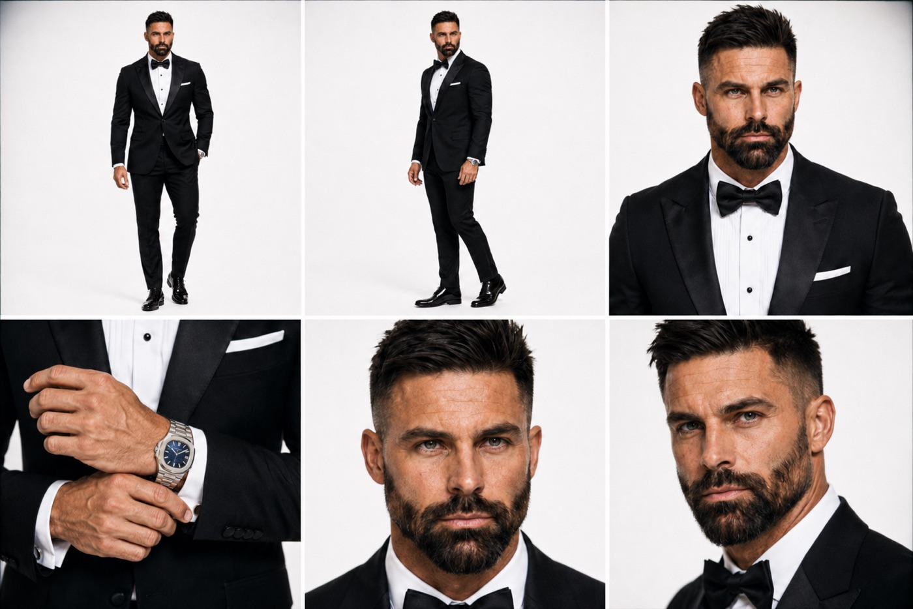
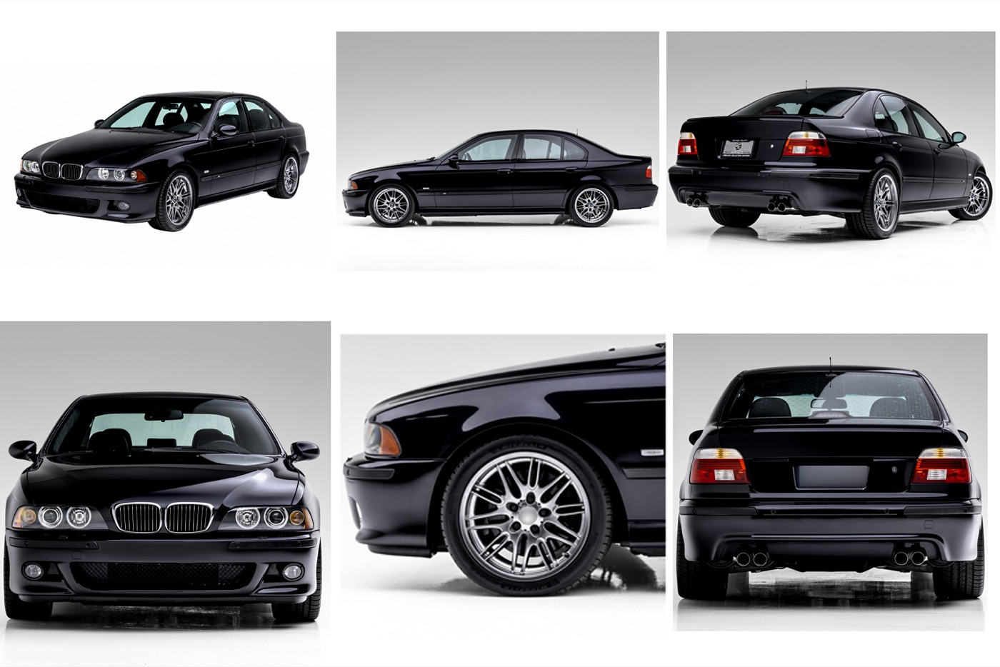
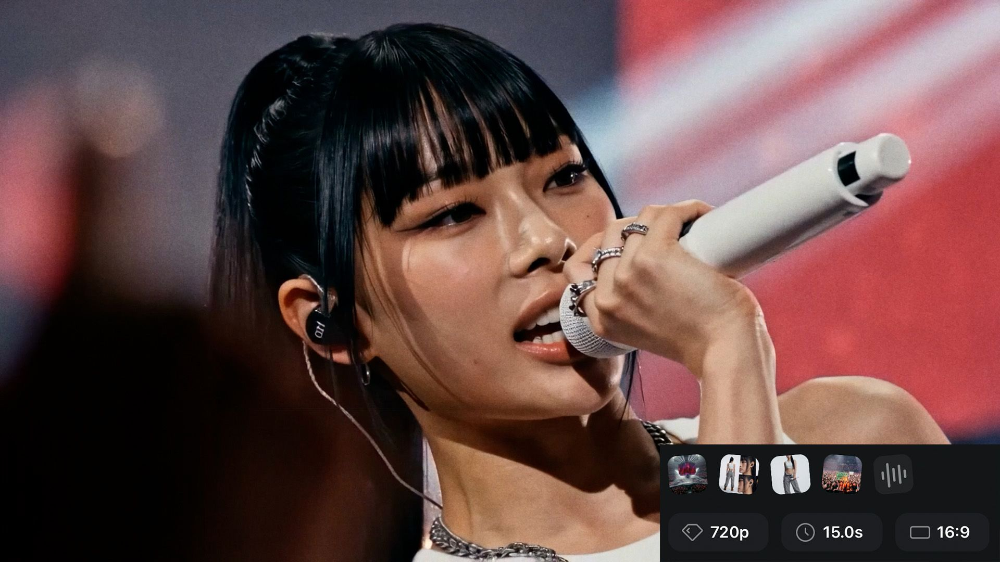
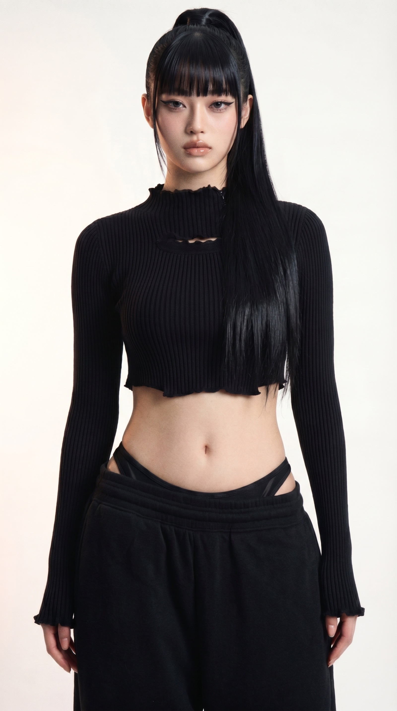
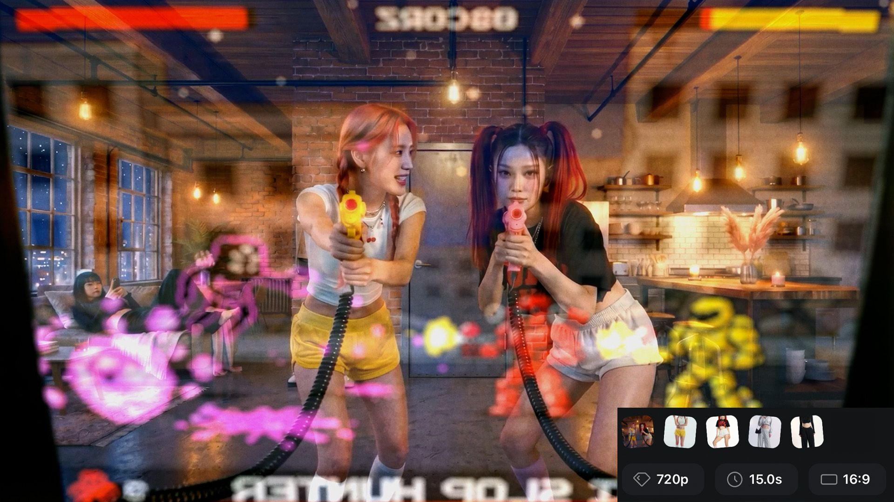

# Character Sheet Examples — What "Locked" Looks Like

> **The examples on this page are the LEGACY 6-panel format.** `banana-pro-director` now defaults to a **3-panel sheet**: LEFT — full-body front, headless (ghost-mannequin hollow or clean neck cut depending on the garment); CENTER — full-body rear, head attached; RIGHT — tight chest-up face lock. One face appears on the whole sheet instead of three or four, which means roughly double the resolution per cell and far less panel-to-panel identity drift. Build a 3-panel sheet by default for any new character. The 6-panel images below remain as legacy illustrations of the multi-angle-lock *principle* — the underlying "don't let the character drift across a sheet" lesson still applies, but the specific 6-cell layout pictured is no longer what you should ask for unless you have an explicit reason to want it (see `banana-pro-director` Mode 2B). **The same applies to the pure-white seamless backdrop and three-point lighting shown below** — those also predate the current locked default of **18% gray seamless with a flat, shadowless grade** (`banana-pro-director` v3.0). New sheets should use gray seamless and the flat grade, not white seamless and three-point lighting.

This is what you're aiming for at **Phase 2 Step 2.3** of the pipeline — a character sheet that shows the same character from multiple angles/framings, generated in a single pass so identity stays locked across the panels. Once you have this, every Seedance shot of that character in Phase 5 can lean on it as the identity anchor, and you'll get consistent face, build, wardrobe, and styling across the whole film. The panel count and layout below (6-panel) are legacy; your own sheet should default to the 3-panel structure described above.

> **Why this matters so much:** without a multi-angle sheet, Seedance is stuck rendering your character from whatever single angle your initial reference happened to show. The most common failure: a producer uploads a side-profile reference, then gets back twelve shots that are all side-profile no matter what the prompt asks for. The sheet is the fix — it gives Seedance the visual data to render the character from any angle.

## Photoreal example — BMW M5 driver

This is the locked 6-panel character sheet for the driver character in the [BMW M5 black-tie commercial](../README.md) at the top of the README. Built in ChatGPT using the locked base reference as the seed.

**Panel layout (legacy 6-panel — see the note at the top of this page for the current 3-panel default):**

1. **Top-left — Full body front** — straight-on neutral stance, full styling readable head-to-shoes
2. **Top-center — Full body 3/4 turn** — body angled 30° from camera, weight on back hip, full styling from a turned angle
3. **Top-right — Full body back** — straight back view, showing hair fall, jacket drape, accessory details from behind
4. **Bottom-left — Waist-up portrait** — head, shoulders, upper torso — face and upper styling lock-in
5. **Bottom-center — Hands detail close-up** — both hands forward, ring stack, nail finish, any held prop
6. **Bottom-right — Face detail close-up** — tight crop from collarbone up, ears, lips, skin texture, eyes

**Why it works:**
- Same person across all six cells. Face, build, hair, and outfit don't drift.
- Same pure-white seamless backdrop in every panel — identity stays locked when the environment is locked.
- Same three-point lighting in every panel. Lighting is half of identity perception in photoreal work.
- Each panel is composed within its cell as if it were its own shot, not a crop of a wider frame.

**How it was made:** locked base reference image (Step 2.2) + the simple ChatGPT identity-preserving prompt at Step 2.3:

> *"Create a 6 panel character sheet out of this character, showing different angles — full body front, 3/4 turn, back, waist-up portrait, hands close-up, and face close-up. Do not change how the character looks at all — keep the same face, build, hair, skin tone, outfit, and proportions. Single horizontal 16:9 frame, 3-column × 2-row grid, clean white seamless backdrop, soft three-point lighting."*

Three attempts in ChatGPT — locked on the second try.

## Prop / vehicle example — BMW E39 M5 reference sheet

For hero props (vehicles, instruments, signature objects), the same multi-angle pattern locks identity across shots. This is the M5 reference sheet built from real-photo BMW press shots and detail captures:

**Panel layout (prop convention):**

1. **Three-quarter front** — the establishing angle
2. **Profile side** — silhouette lock
3. **Rear** — taillight signature, badge, exhaust detail
4. **Cockpit interior** — POV from driver seat
5. **Dashboard close-up** — gauge cluster typography, switchgear
6. **Signature detail** — for the M5, the H-pattern shift gate with M-tri-color stitching

**Why this approach beats AI-generating a prop sheet from scratch:** because the M5 is a real-world object, real photos are ground-truth identity at zero generation credits. The pipeline's principle is *real photos > AI plates whenever the subject exists in reality* — see [CLAUDE.md "Real-world references" section](../CLAUDE.md) for the full reasoning. Greg assembled this sheet from real BMW press photos and Bring-a-Trailer detail shots; total cost was the five minutes of finding the photos.

## What multi-shot consistency looks like

Here's why the character sheet step matters in the finished product. These three stills are all from Joey's **CTRL** AI-generated K-Pop production — different shots, different scenes, different cinema modes, but the same locked character identity carries through because the character sheet was built before any Seedance shot was generated:

| On-stage performance | Tight subject portrait | BTS arcade scene |
|---|---|---|
|  |  |  |

That cross-shot consistency is downstream of the character sheet. No sheet, no consistency.

## Cartoon / illustration example

*(Slot reserved — example to be added once a cartoon-register project lands a locked sheet. If you produce one with this pipeline and want to contribute it as the canonical cartoon example, drop it in `docs/images/example-cartoon-character-sheet.jpg` and we'll wire it in.)*

For the cartoon panel layout — front · 3/4 left · 3/4 right · expressions row · signature pose · detail close-up — see [ai-film-director Step 2.3, "Stylized illustration / cartoon" branch](../ai-film-director/SKILL.md) for the full guidance and the pre-written ChatGPT prompt. The key difference vs. photoreal: **skip the rear-profile panel** (2D characters look off-model from straight back) and add an expressions row + signature pose instead.

## Anime / comic example

*(Slot reserved — same contribution path. Drop a sheet at `docs/images/example-anime-character-sheet.jpg`.)*

## How to read these examples during your own Step 2.3

When the orchestrator hands you the pause instruction for character sheet generation, you can ask to see these examples directly:

> *"Show me an example sheet."*

The orchestrator will open this file (`docs/character-sheet-examples.md`) in your viewer. Map the *identity-lock-across-cells discipline* shown here to your own 3-panel sheet — same face, build, and wardrobe holding across LEFT (headless front), CENTER (rear, head on), and RIGHT (chest-up face lock). Aim to land something at this level of consistency before moving to Phase 3.

If your first attempt drifts on a specific panel, the most common culprit on a 3-panel sheet is the CENTER (rear) panel losing wardrobe fidelity, or the RIGHT (face-lock) panel drifting slightly off the LEFT panel's bone structure. Follow up with the orchestrator and we'll either prompt-refine the panel or branch to a tighter mode. (On the legacy 6-panel format pictured above, the common drift points were panel 3/back or panel 5/hands.)

## See also

- [`ai-film-director/SKILL.md`](../ai-film-director/SKILL.md) **Step 2.3** — the orchestrator step that builds these sheets, including the cartoon / anime / hybrid register branches
- [`banana-pro-director/SKILL.md`](../banana-pro-director/SKILL.md) **Mode 2** — the specialist that composes the structured panel prompt
- [`CLAUDE.md`](../CLAUDE.md) — workspace overview, including the "real photos > AI plates" principle that's worth applying at this step when references exist
